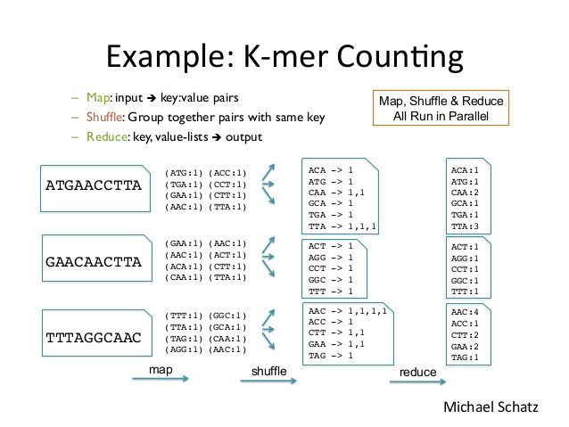

[]()

K-mer
=====
The term k-mer typically refers to all the possible substrings of 
length k that are contained in a string. In computational genomics, 
k-mers refer to all the possible subsequences (of length k) from a 
read obtained through DNA Sequencing. The amount of k-mers possible 
given a string of length, L, is ````L-k+1```` whilst 
the number of possible k-mers given n possibilities (4 in the case 
of DNA e.g. ACTG) is ````n^k````. K-mers are 
typically used during sequence assembly,[1] but can also be used in 
sequence alignment. In the context of the human genome, k-mers of 
various lengths have been used to explain variability in mutation 
rates. (source: Wikipedia: https://en.wikipedia.org/wiki/K-mer)
